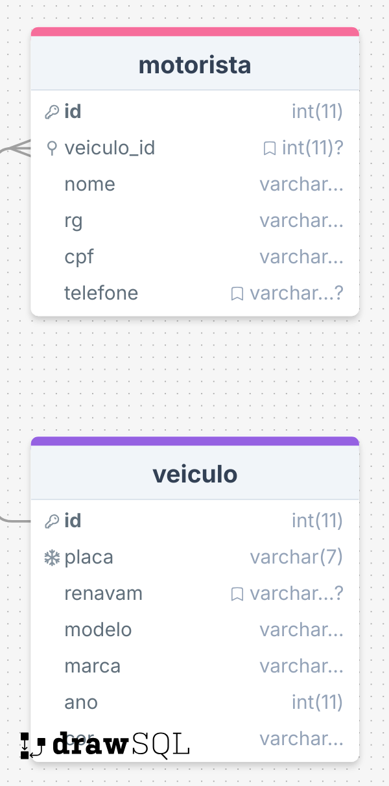

# Desafio Técnico Trafegus - CRUD de Veículos e Motoristas ☑️

Este projeto foi desenvolvido utilizando Zend Framework 2 e Doctrine para implementar um sistema de CRUD de veículos e motoristas.

## 1. Configuração do Projeto

### 1.1 Clone o Repositório
Clone o repositório do projeto em sua máquina local utilizando o Git.

```bash
git clone https://github.com/seu-usuario/seu-repositorio.git
```
### 1.2 Instalação das Dependências
Utilize o Composer para instalar todas as dependências necessárias:

```bash
composer install
```

### 1.3 Configuração do Banco de Dados

-> Crie um banco de dados localmente com o nome trafegus.

Execute o seguinte comando para criar o esquema das tabelas:
```bash
bin/doctrine-module orm:schema-tool:create
```

Caso queira ver a lista completa de comandos do Doctrine disponíveis, utilize:

```bash
bin/doctrine-module list
```

### 1.4 Execução do Servidor

Inicie o servidor PHP para rodar o projeto localmente:

```bash
php -S localhost:8080 -t public
```
## 2. Dados Fictícios para Testar

Para facilitar os testes de cadastro de veículos e motoristas, você pode utilizar os seguintes geradores de dados online:

[Motorista](https://www.4devs.com.br/gerador_de_pessoas)  
[Veículo](https://www.4devs.com.br/gerador_de_veiculos)

## 3. Estrutura Modular

O projeto está organizado em módulos independentes que representam as entidades principais. Abaixo está uma visão geral da estrutura dos módulos:

```bash
/module
    /Base
        /config
        /language
        /src
            /Controller
            /Entity
            /Service
        /view
        Module.php
    /Motorista
        /config
        /src
            /Controller
            /Entity
            /Service
        /view
        Module.php
    /Veiculo
        /config
        /src
            /Controller
            /Entity
            /Service
        /view
        Module.php
```

### 1.1 Módulo Base

O módulo Base foi criado com o objetivo de centralizar funcionalidades comuns, tornando a implementação de novos módulos mais simples e padronizada. Ele contém classes abstratas que são reutilizadas nos módulos específicos, como Motorista e Veiculo. As funcionalidades implementadas no Base incluem:

Controllers Abstratos: Controladores genéricos para gerenciar ações CRUD comuns.
Entities Abstratas: Entidades base que contêm a estrutura mínima necessária para qualquer entidade do projeto.
Services Abstratos: Serviços que fornecem métodos comuns, como salvar, deletar e buscar entidades.
Layout e Páginas de Erro Padrão: O módulo Base também define layouts e páginas de erro padrão para todo o sistema, garantindo uma aparência consistente.

### 1.2 Implementação dos Módulos Morotista e Veículo

Com a estrutura do Base, a implementação dos módulos de Motorista e Veiculo foi feita de maneira simples, estendendo os controladores, entidades e serviços do Base:

Motorista: Implementa o CRUD para motoristas, aproveitando as classes abstratas do Base. Este módulo define as regras específicas para o cadastro de motoristas, como validação de campos obrigatórios (ex: CPF, RG, nome).

Veiculo: Similar ao Motorista, o módulo Veiculo também herda do Base, implementando as funcionalidades específicas de um CRUD para veículos, com validações como placa e renavam.

Essa arquitetura modular facilita a manutenção e escalabilidade do projeto, permitindo a criação de novos módulos reutilizando o código já existente no Base.

## 3. Estrutura do Banco de Dados


